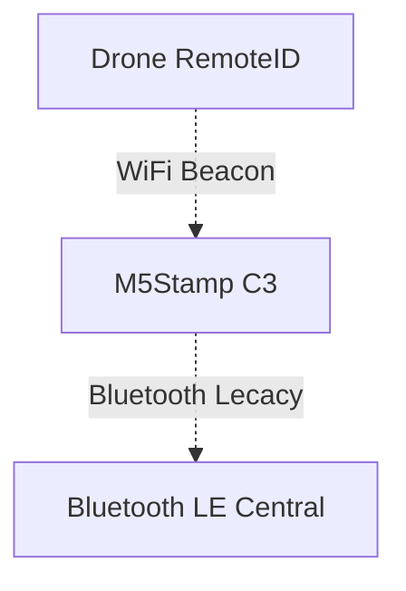

# WiFi Beacon リモートIDをM5Stamp C3で受信する

> Under Construction

DJIなどWiFi BeaconのリモートIDをM5Stamp C3で受信してBLEでスマホなどに中継するファームウェアです。

中継したリモートIDを[BvリモートID スマホアプリ](https://www.braveridge.com/product_support/remoteid/#app)で地図上に表示できる機能を開発中です。（アプリ内課金）

## データフロー

---

## M5Stamp C3へ書き込む

### 開発環境
- VS Code (1.98.0)
- Platform IO IDE (3.3.4)

### Macのみ
#### USBドライバをインストールする
- https://github.com/Xinyuan-LilyGO/LilyGo-T-Call-SIM800/files/7037260/CH9102_Mac_Driver.zip

### ファームウェアをM5StampC3へ書き込む
1. PCとM5StampC3をUSBで接続する
   - ターミナルで `% ls /dev|grep "tty.usbserial"` を実行して `tty.usbserial-XXX` と表示されることを確認する
2. WiFiBeacon-RemoteIdReceiver-M5StampC3リポジトリをクローンまたはダウンロードする
3. PlatformIO で WiFiBeacon-RemoteIdReceiver-M5StampC3 を開く
4. Build, Upload を実行してファームウェアを書き込む
   
### 動作確認
#### Platform IOのシリアルモニター
1. `wifi scan channel : 1`、`wifi scan channel : 2`、、、と表示されていることを確認する

#### BLEスマホアプリ
1. ドローン(e.g., DJI)を飛行させて、WiFi BeaconのリモートIDを発信させる
2. [nRF Connect for Mobile](https://www.nordicsemi.com/Products/Development-tools/nRF-Connect-for-mobile) などスマホアプリから `BVRRM5C3` に接続する
3. Characteristic UUID:`833bbc01-588e-4ca2-9cd3-717200016c6c`を受信可能にする
4. リモートIDデータが表示されることを確認する

#### BvリモートID スマホアプリ

> ※開発中

1. ドローン(e.g., DJI)を飛行させて、WiFi BeaconのリモートIDを発信させる
2. [BvリモートID スマホアプリ](https://www.braveridge.com/product_support/remoteid/#app) から `M5StampC3受信機` に接続する
3. RawDataロガーにリモートIDデータが表示されることを確認する

## License
[MIT license](./LICENSE)
